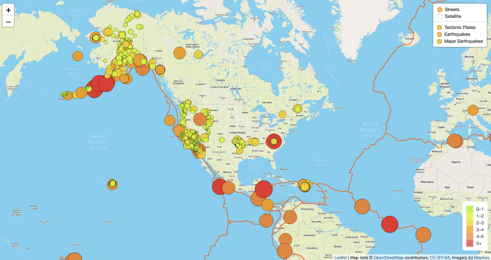
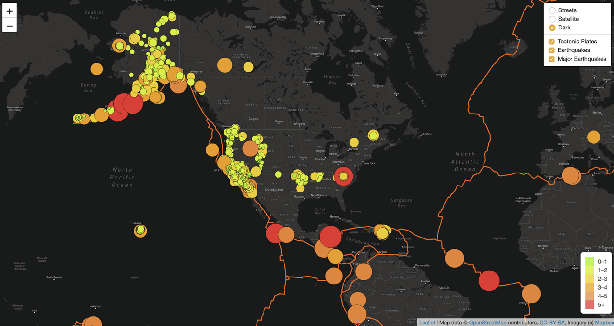

# Mapping_Earthquakes

## Background

The purpose of this project is to visually show the differences between the magnitudes of earthquakes all over the world for the last seven days, in relation to the tectonic plates' location on the earth, further highlighting earthquakes with a magnitude greater than 4.5.

Data Sources: 
* US Geolical Survey (USGS) website: https://earthquake.usgs.gov/
* USGS GeoJSON summary feed for M4.5+ Earthquakes: https://earthquake.usgs.gov/earthquakes/feed/v1.0/summary/4.5_week.geojson
* GeoJSON/PB2002_boundaries.json file from a specialized github page on tectonic plates 

## Approach:
* Use the JavaScript and the D3.js library to retrieve the coordinates and magnitudes of the earthquakes from the GeoJSON data. 
* Use the Leaflet library to plot the data on a Mapbox map through an API request and create interactivity for the earthquake data.

## Results

Map with interactivity to toggle between street and satellite view as well as between techtonic plate, earthquake, and major earthquake view:

Map further edited to inlcude a dark view:

 
